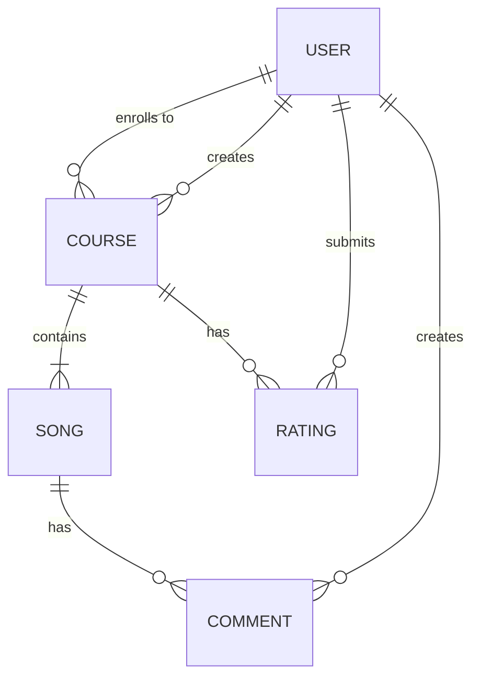
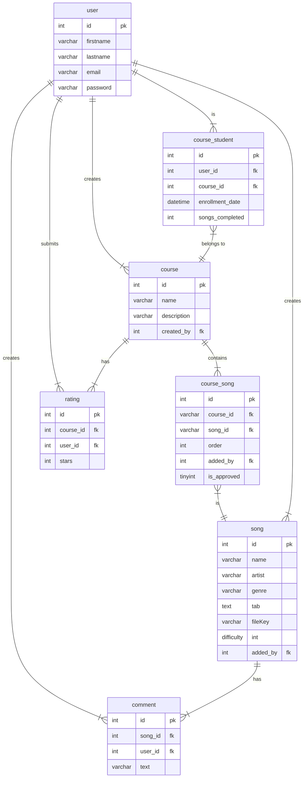

# The Musician's Path
## Overview
App with courses for practicing the learning of instruments with actual songs.

## Problem definition
When learning anything, the most important thing is practice. As for being a musician, there are already many courses and platforms to learn the theory. But when it comes to reinforce that learning with practice, the courses often don't include real songs, and if they do, sometimes the user doesn't like the songs included. With The Musician's Path, you can pick a course with a list of songs you like, or create one of your preference.

Example: "The Beatles' begginers course"
"Course with songs from beginner to advance to practice with Beatles songs"
1. Norwegian Wood - Difficulty: 3/10
2. I want to hold your hand - Difficulty: 5/10
3. Hey Jude - Difficulty: 8/10

## Who is this application for?
This application is for musicians of any level that already have some theoretical fundaments, but want to level up their skills by practicing with real songs.

## MOSCOW
### Must have
- User can create an account
- User can enroll to existant course
- User can create new songs
- User can create a course
- User can add/remove songs from their own course
### Should have
- User can add rating to course
- User can add comment to song
### Could have
- Support for files instead of/along with plain text tabs
- Course owner can accept or reject other users' song request to course
### Will not have
- Multiple files per song
- If file is a video, video player

## Domain model diagram

## Entity relation diagram

