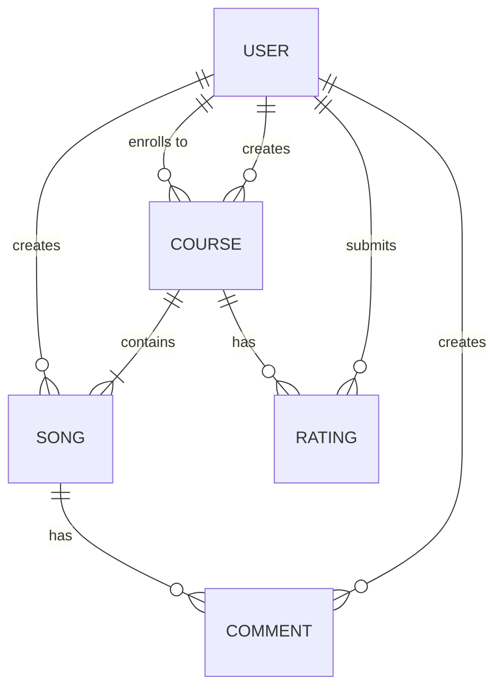
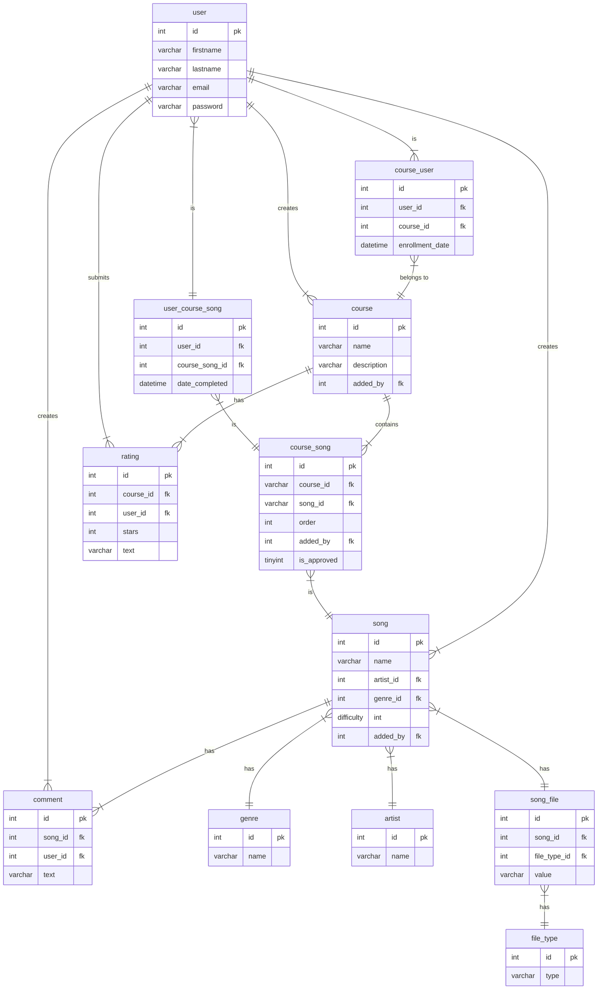

# The Musician's Path
## Overview
App with courses for practicing the learning of instruments with actual songs.

## Problem definition
When learning anything, the most important thing is practice. As for being a musician, there are already many courses and platforms to learn the theory. But when it comes to reinforce that learning with practice, the courses often don't include real songs, and if they do, sometimes the user doesn't like the songs included. With The Musician's Path, you can pick a course with a list of songs you like, or create one of your preference.

Example: "The Beatles' begginers course"
"Course with songs from beginner to advance to practice with Beatles songs"
1. Norwegian Wood - Difficulty: 3/10
2. I want to hold your hand - Difficulty: 5/10
3. Hey Jude - Difficulty: 8/10

## Who is this application for?
This application is for musicians of any level that already have some theoretical fundaments, but want to level up their skills by practicing with real songs.

## MOSCOW
### Must have
- User can create an account and login
- User can enroll to existant course
- User can create/edit/delete songs
- User can create/edit/delete a course
- User can add/remove songs from their own course
### Should have
- User can add rating to course
- User can add/edit/delete comment to song
### Could have
- Ability to upload files besides plain text tab for a song
- Ability to add a YouTube link for a song
- Ability to download added files and open YouTube link
- Course owner can accept or reject other users' song request to course
### Will not have
- If file is a video, show a video player
- If file is a PDF, show preview
- If file is YouTube link, show it embedded instead of opening apart.

## Domain model diagram

## Entity relation diagram


## API Specifications
### Users
`POST /users`
##### Creates a user
Request
```json
{
  "firstName": "John",
  "lastName": "Doe",
  "email": "johndoe@email.com",
  "password": "Password",
}
```
Response: `201 Created`

### Courses
`GET /courses?searchquery=beatles`
##### Returns a list of courses optionally filtered by search query
Response: `200 OK`
```json
[
  {
    "id": 1,
    "name": "The Beatles: Begginer's Path",
    "description": "Only easy songs to play by The Beatles",
    "addedBy": 1,
  },
  {
    "id": 2,
    "name": "80's Classics - From Beginner to Advanced",
    "description": "All 80s songs starting from easy ones going through tough ones at the end",
    "addedBy": 1,
  }
]
```

`GET /courses/:id`
##### Returns a course by id
Response: `200 OK`
```json
{
  "id": 1,
  "name": "The Beatles: Begginer's Path",
  "description": "Only easy songs to play by The Beatles",
  "addedBy": 1,
  "averageRating": 4.5,
  "songs": [
    {
      "id": 1,
      "name": "I want to hold your hand",
      "artist": "The Beatles",
      "genre": "Rock",
      "difficulty": 3,
      "addedBy": "John Doe",
    },
    {
      "id": 2,
      "name": "Penny Lane",
      "artist": "The Beatles",
      "genre": "Rock",
      "difficulty": 5,
      "addedBy": "John Doe",
    }
  ]
}
```

`POST /courses`
##### Creates a course
Request:
```json
{
  "name": "The Beatles' Begginer's Path",
  "description": "Only easy songs to play by The Beatles",
  "addedBy": 1,
}
```
Response: `201 Created`

`PUT /courses/:id`
##### Updates a course by id
Request:
```json
{
  "name": "The Beatles' Begginer's Path",
  "description": "Only easy songs to play by The Beatles",
}
```
Response: `200 OK`

`DELETE /courses/:id`
##### Deletes a course by id
Response: `200 OK`

`GET /courses/:id/ratings`
##### Get all ratings from a course
Response: `200 OK`
```json
[
  {
    "id": 1,
    "user": {
      "firstName": "John",
      "lastName": "Doe",
      "email": "johndoe@email.com",
    },
    "stars": 5,
    "text": "Amazing course!"
  },
  {
    "id": 2,
    "user": {
      "firstName": "Jane",
      "lastName": "Doe",
      "email": "janedoe@email.com",
    },
    "stars": 3,
    "text": null
  },
]
```

`POST /courses/:id/ratings`
##### Submits a rating for a course
Request:
```json
{
  "addedBy": 1,
  "stars": 5,
  "text": "Amazing course!"
}
```
Response: `201 Created`

`POST /courses/:id/users`
##### Enrolls a user to a course
Request:
```json
{
  "userId": 1,
  "enrollmentDate": "2023-05-26",
}
```
Response: `201 Created`

`POST /courses/:id/songs`
##### Adds a song to a course
Request:
```json
{
  "songId": 1,
  "order": 2,
  "addedBy": 1,
}
```
Response: `201 Created`

### Songs
`GET /songs?artistid=1&genreid=1&searchquery=strawberry`
##### Returns a list of songs filtered by search query, artistId or genreId
Response: `200 OK`
```json
[
  {
    "id": 1,
    "name": "I want to hold your hand",
    "artist": "The Beatles",
    "genre": "Rock",
    "difficulty": 3,
    "addedBy": "John Doe",
  },
  {
    "id": 2,
    "name": "Penny Lane",
    "artist": "The Beatles",
    "genre": "Rock",
    "difficulty": 5,
    "addedBy": "John Doe",
  }
]
```

`GET /songs/:id`
##### Returns a song by id
Response: `200 OK`
```json
{
  "id": 2,
  "name": "I want to hold your hand",
  "artist": "The Beatles",
  "genre": "Rock",
  "difficulty": 3,
  "addedBy": 1,
  "songFiles": [
    {
      "fileTypeId": 1,
      "fileType": "Plain text tab",
      "content": "..."
    },
    {
      "fileTypeId": 2,
      "fileType": "YouTube Link",
      "content": "https://www.youtube.com/"
    },
  ]
}
```

`POST /song`
##### Creates a song
Request:
```json
{
  "name": "Penny Lane",
  "artistId": 1,
  "genreId": 1,
  "difficulty": 5,
  "addedBy": 1,
  "files": [
    {
      "fileTypeId": 1,
      "content": "C G Bm D"
    },
    {
      "fileTypeId": 2,
      "content": "https://www.youtube.com"
    },
  ]
}
```
Response: `201 Created`

`PUT /song/:id`
##### Updates a song by id
Request:
```json
{
  "name": "Penny Lane",
  "artistId": 1,
  "genreId": 1,
  "difficulty": 5,
}
```
Response: `200 OK`

`DELETE /songs/:id`
##### Deletes a song by id
Response: `200 OK`

`GET /songs/:id/comments`
##### Get all comments from a song
Response: `200 OK`
```json
[
  {
    "id": 1,
    "user": {
      "firstName": "John",
      "lastName": "Doe",
      "email": "johndoe@email.com",
    },
    "text": "I can't play the transition between C and G chords. Any advice?"
  },
  {
    "id": 2,
    "user": {
      "firstName": "Jane",
      "lastName": "Doe",
      "email": "janedoe@email.com",
    },
    "text": "Try playing G in 2nd inversion!"
  },
]
```

`POST /songs/:id/comments`
##### Posts a comment for a song
Request:
```json
{
  "addedBy": 1,
  "text": "I can't play the transition between C and G chords. Any advice?"
}
```
Response: `201 Created`

`POST /songs/:id/files`
##### Add a file to a song
Request:
```json
{
  "fileTypeId": 1,
  "value": "C D Gm B"
}
```
Response: `201 Created`

### File types
`GET /file_types`
##### Get all file types
Response: `200 OK`
```json
[
  {
    "id": 1,
    "type": "Plain text tab"
  },
  {
    "id": 2,
    "type": "YouTube link"
  }
]
```

### Genres
`GET /genres`
##### Get all genres
Response: `200 OK`
```json
[
  {
    "id": 1,
    "name": "Rock"
  },
  {
    "id": 2,
    "name": "Pop"
  }
]
```

### Artists
`GET /artists`
##### Get all artists
Response: `200 OK`
```json
[
  {
    "id": 1,
    "name": "The Beatles"
  },
  {
    "id": 2,
    "name": "Kendrick Lamar"
  }
]
```
//complete song of course
//upload songfile and remove songfile
//`DELETE /songs/:id/files`
//##### Remove file from a song
//Response: `200 OK`
